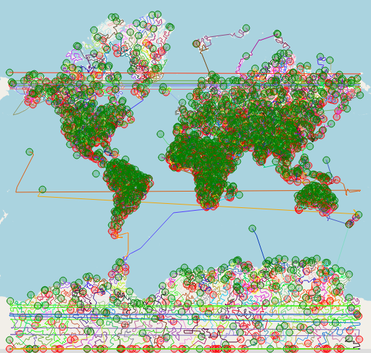
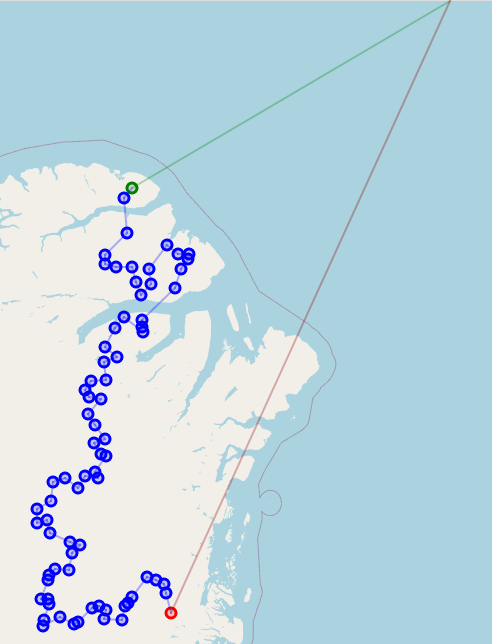

# Santa Challenge


## Introduction

In the context of a algorithms course, the Santa-Challenge could be solved as a voluntary exercise. This repository contains the code and a short description on how the exercise is solved.
This challenge has originally been uploaded to <a href="https://www.kaggle.com/competitions/santas-stolen-sleigh" target="_blank">kaggle.com</a> in 2016.

Refer to the <a href="https://resistor10k1.github.io/santa-challenge/" target="_blank">wiki</a>  for the description of the problem and for additional information.

See [Result](#result) for the result achieved with the code in this repository.

## Backstory

Santa's magical sleigh has gone missing. Unfortunately, Christmas is very close and Santa does not want to cancel. Therefore, Santa needs the help of Computer-Science students with nothing better to do than to determine a tour to deliver the gifts as efficient as possible and to save Christmas.

## Get started

### Build

Clone the git repository:
```
git clone https://github.com/Resistor10k1/santa-challenge.git
cd santa-challenge
```
And just run the build script:
```
bash build.sh
```
Or do it manually:
```
mkdir build && cd build
cmake ..
cmake --build . --target all
```

**_NOTE:_**  If the Clang compiler is used, the `libomp-dev` library must be installed.

### Run

Jump into to build folder (`cd build`) and run the program. The program takes the relative path to the data file as an argument. If no argument is given, a small example data file is taken to show the program's functionality.
```
./santa-challenge "../data/gifts.csv"
```
Three different data files are available in the *data* folder:
- *example_data.csv*: A very small data set of 15 gifts. Suitable for a quick test-run of the program.
- *small_gifts.csv*: A small data set of 200 gifts. Suitable for testing.
- *gifts.csv*: The data set of 100'000 gifts, used to solve the challenge.

When the calculations are finished, the result is saved in the folder *data*. The format of the file is **output_trips_*\<year\>*-*\<month\>*-*\<day\>*_*\<hour\>*-*\<minute\>*.csv**.

## Solution approach

In a first step, all gifts are sorted by the distance to the North-Pole in ascending order. Starting with the closest gift, the tours are built with Nearest-Neighbour approach to find an initial solution.
For each tour, a Simulated Annealing algorithm is run, to improve the existing tour and find a better solution.

**Simulated-Annealing parameters:**

Parameter                              | Value
:---                                   | :----:
Neighbourhood size for 2-opt swapping  | 25
"Cooling" intervall with $\alpha=0.9$  | 32
"Reheating" intervall with $\beta=1.3$ | 128
Initial temperature $T_0$              | 100'000
Final temperature $T_f$                | 0.001

## Result

output_trips_2023-12-12_14-52.csv:
- Jupyter output: 13451646157.283916
- C++ output: 13451646096.8983364105 in 4103592 ms

probablyNewBest.csv:
- Jupyter output: 13450929488.631664
- C++ output: 13450929428.2493152618 in 9375112 ms

candidate_2023-12-17_17-22.csv:
- kaggle output: 13'449'226'461.1015
- Jupyter output: 13'449'245'037.96434
- C++ output: 13'449'244'977.5895557404 in 20749713 ms, 1430 tours
- Magic numbers: {1, 25, 32, 128, 100000.0, 0.001}

Cluster-Loader instead of Nearest-Neighbour-Loader:
- C++ output: 37'894'714'449.319519043 in 19663718 ms, 1431 tours

without SA:
13'485'862'196.2283859253 in 4139765 ms

For verifing the solution a Jupyter notebook provided by the lecturer is used. The achieved weighted-reindeer-weariness is 13'452'086'880.13939 in 1430 trips.

When playing around with different strategies for getting an initial solution, it becomes clear that this is a crucial step. The Simulated-Annealing algorithm gives some improvement. If the initial solution is already not very good, many improvements can be made but might not result in a very good solution in the end.

All tours are shown in Figure "Overview of all tours". All tours are also shown in an interactive <a href="https://resistor10k1.github.io/santa-challenge/figures/map.html" target="_blank">map</a>.



A single tour looks something like this:




## Code

All code is written in C++. For a detailed code documentation refer to this <a href="https://resistor10k1.github.io/santa-challenge/doxygen/html/index.html" target="_blank">Link</a>.
<!-- All code is written in C++. For a detailed code documentation refer to this <a href="doxygen/html/index.html" target="_blank">Link</a>. -->

## Some other ideas

In general, just find 'a' solution and then try to improve it with local improvements such as *k-opt Neighbourhood*, *Randomized Local Search* or *Simulated Annealing*.

### How to find 'a' solution

1. Fill the sleigh with knapsack and the closest locations and optimize with some TSP algorithm.
2. K-means clustering to group the locations which are close to each other. Apply some threshold (heuristics) for maximum distance within the group and also check that the sleigh weight is not exceeded. Start with the locations furthest away and optimize with some TSP algorithm.

### Just some idea for the algorithm
*How to cluster:*<br>
1. *Take the closest point p0 and add it to the sleigh.*
2. *Check if the sleigh still has space and add the closest point to p0 to the sleigh. Repeat.*
3. *Solve TSP locally in the found point subset. The two closest point to the pole are the start resp. end points.*
4. *Restart*


